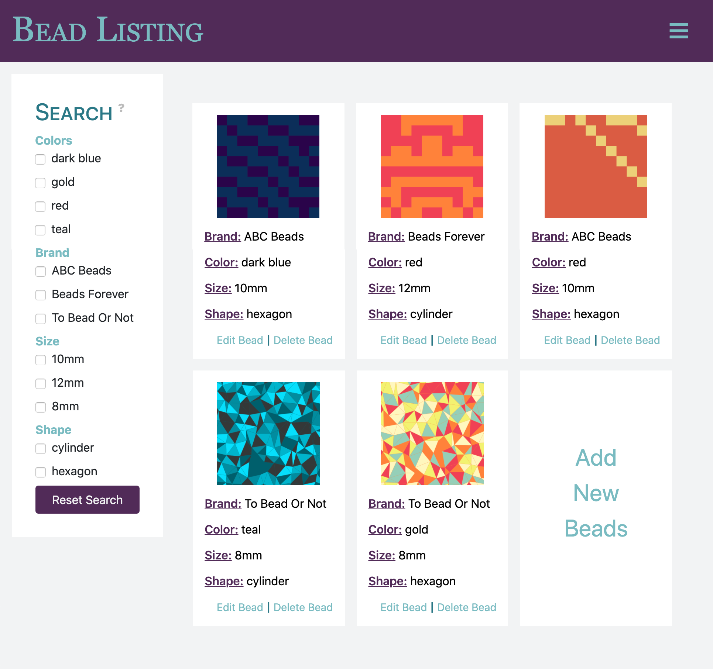

# Summary


(placeholder images from [Generative Placeholders](https://generative-placeholders.glitch.me/))

__Bead Listing__ is a website that allows users to keep track of beads they own. The brand, color, shape, size can be specified, and beads can be sorted based on these parameters. A description and image can also be attached to each bead.

This application was initially created during CS189: Programming Practicum (Spring 2020) at Harvey Mudd College.

# Deployment
Deployment requires Docker and Docker Compose, which can be found [here](https://www.docker.com/products/docker-desktop). Docker Compose comes with Docker Desktop.

To deploy the project:

```
docker-compose up -d
```

The `-d` flag signals the container to run in the background, so commands can still be run on the terminal.

Also, the _first_ time the project is deployed, a database must be created and set-up (migrated):

```
docker-compose run web rake db:create
docker-compose run web rake db:migrate
```
Run the commands with a slight delay between them (no more than a few seconds), to allow the database to be properly created before it attempts to be set-up.

The website will be hosted at [http://localhost:3900](http://localhost:3900).

To stop the container:
```
docker-compose down
```

If you wish to run commands within the container (like `rails console` and other Rails commands):

```
docker exec -it <container name> /bin/bash
```
This starts a bash terminal within the container. The bash terminal can be exited back to the host terminal with the command `exit`. To find the container name:
```
docker ps
```
This will list all running containers. The container name will likely be `bead-listing_web_1`.

# Development
If changes are made to the Gemfile or the Compose file, the application must be rebuilt:
```
docker-compose up --build
```
If a full rebuild is necessary, then:
```
docker-compose run web bundle install
```
followed by the previous command.
